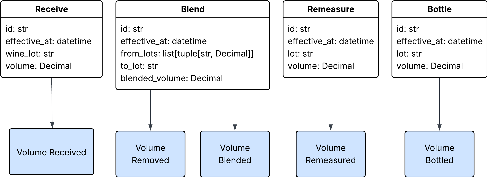

# Winemaking with Django and Mutable Event Sourcing

**We're hiring!**

We are looking for an experienced engineer to join our team. If this project is exciting to you, and you want to dive into
the world of winemaking to help our users run healthier wine businesses, then come join us!

**[Careers at InnoVint](https://innovint.us/careers)**

This project demonstrates how our team at InnoVint has used the Django ORM to implement a mutable event sourcing system.

The domain concepts and some technical implementations here are simplified for the sake of brevity and to focus on the
ideas of the event sourcing system.

If there are any questions about the project, please use the "Discussions" feature to reach out.

## Running the Project

The project uses [uv](https://docs.astral.sh/uv/) to maintain dependencies and control virtual environments.

To install dependencies

```bash
uv install
```

To run the project and tests, you will need to run postgres locally. There is a docker compose file that will start
postgres at a non-standard port (5345). The project does not work on Sqlite because of missing database query features.

```bash
docker-compose up postgres
```

To run the tests

```bash
uv run pytest
```

## Core Event Sourcing Concepts

To stick to concepts most people understand, we'll discuss the concepts of the implementation using a common domain: a 
bank account.

### Events

Our events are implemented as Pydantic classes and all extend the [`AggregateEvent`](src/eventsourcing/domain_events.py) class.

Event of these events should describe the details of our domain. They will be specific to our aggregates. For example,
in with a bank account, we will likely have events like `Opened`, `Deposited`, and `Withdrawn`. Conventionally, our events
should all be named in the past tense, as these are things that have already happened. Each will have a unique `event_type`
value that allows for easy identification and filtering by type.

```python
from decimal import Decimal

from eventsourcing.domain_events import AggregateEvent

class AccountOpened(AggregateEvent):
    event_type = "account_opened"

class MoneyDeposited(AggregateEvent):
    event_type = "money_deposited"
    amount: Decimal

class MoneyWithdrawn(AggregateEvent):
    event_type = "money_withdrawn"
    amount: Decimal
```

### Aggregate Models

Our core domain models that we want to implement using event sourcing are defined as Django models that extend
[`AggregateModel`](src/eventsourcing/models.py) class. The current state of this aggregate will be stored in the database
as a standard Django model.

Altering and updating these models is done by creating and applying events. Our convention is to generate these behaviors
through domain-driven functions that encapsulate the logic.

```python
from typing import Self
from django.db import models

from eventsourcing.models import AggregateModel

class BankAccount(AggregateModel):
    balance = models.DecimalField(max_digits=10, decimal_places=2, default=0)

    @classmethod
    def open(cls) -> Self:
        instance = cls()
        
        instance.apply(AccountOpened())
        
        return instance

    def deposit(self, amount: Decimal):
        self.apply(MoneyDeposited(amount=amount))
```
Along with the domain functions that generate the events, we also need functions that know how to apply the events onto
the aggregates. By default, the `apply` method will search for a function on the class using the name of the event class
and converting it to snake case. So `MoneyDeposited` will look for a `apply_money_deposited` function.

```python
class BankAccount(AggregateModel):
    # ....

    def apply_money_deposited(self, event: MoneyDeposited):
        self.balance += event.amount
```

### Event Stores

Our event stores are also implemented as Django models. These models are used to store the events that have been applied
to the aggregate. For each of our aggregates we will implement a separate event store model that extends the
[`AggregateEventModel`](src/eventsourcing/models.py) class.

To make introspection on the event store easier, we explicitly define the types of events it holds.

We also explicitly define this as the event store for our aggregate.

```python
from src.eventsourcing.models import AggregateEventModel
from src.eventsourcing.models import AggregateModel

class BankAccountEventStore(AggregateEventModel):
    event_types = [
        AccountOpened,
        MoneyDeposited,
        MoneyWithdrawn,
    ]


class BankAccount(AggregateModel):
    # ....

    event_model = BankAccountEventStore
```

### Aggregate Repository

The [`AggregateRepository`](src/eventsourcing/aggregate_repository.py) is a singleton that manages the state of all new
events and new/updated aggregates. This singleton implements a "unit-of-work" pattern, similar to many ORM frameworks.
The unit of work is entered using the `store_aggregate_changes` decorator.

```python
from decimal import Decimal

from eventsourcing.aggregate_repository import store_aggregate_changes

@store_aggregate_changes
def deposit_money(account_id: str, amount: Decimal):
    account = BankAccount.objects.get(id=account_id)
    account.deposit(amount)
```

Once we are in this context manager, any calls to `apply` on an aggregate will do a couple of things. First, it will
append the new event to an in-memory log of events held in our singleton AggregateRepository. Second, it will save the
aggregate to an in-memory store of updated aggregates.

Whenever we exit the context manager, the AggregateRepository will insert the new events into each aggregate's event
store. It will also persist each of the updated aggregates to the database.

### Temporal Queries

A major benefit of event sourcing is being able to inspect the state of an aggregate at a specific point in time. This is
accomplished by replaying the events in the event store only up to a particular point in time. Using our bank account,
for example, we can calculate the balance of the account at any point in time.

Here we use the `load` function on our aggregates instead of the `apply` function. The only real difference is that
`load` does not interact with the AggregateRepository, and so we end up with a read-only view of the aggregate.

```python
from datetime import datetime

def get_balance_at_time(account_id: str, dt: datetime):
    events = BankAccountEventStore.objects.filter(aggregate_id=account_id, occurred_at__lte=dt)

    instance = BankAccount()

    for event in events:
        instance.load(event)

    return instance.balance
```

## The Winemaking Domain

Now we can introduce the winemaking domain implemented in this project and that we will use to demonstrate the 
mutable nature of the event sourcing system.

First we have our aggregate [`WineLot`](src/winemaking/models/wine_lot.py). This is our core domain model in making wine
and represents a batch of wine currently under production. It has a volume, that for the sake of simplicity we'll say in
measured in gallons, and a unique code which our users use to reference it.

We will use a very simplified winemaking workflow focused on blending and bottling.

1. **Receiving volume** This action is how volume initially enters the system. We can picture this as receiving fermented
wine from another facility in a tanker truck.
2. **Remeasuring a lot** This is a behavior that has to happen frequently in wineries. There are any number of reasons
that a vessel may hold less wine in it than we originally expected. Moving wine from one tank to another, filtering, and
blending are all imperfect actions that incur losses in volume. Also, because wine is an alcoholic liquid and we often
hold it in porous containers like wooden barrels or clay or concrete tanks, it has a habit of being absorbed into or through
the vessels holding it, causing losses. For this reason, it is critical to remeasure wines before performing other actions,
like blends, to be sure how much you have. Also, the US requires that wine producers track all gains and losses and
explain them in some fashion through an auditing process. This remeasurement allow for tracking when losses occur and
attributing them to a cause.
3. **Blending lots** Blending is an important step in many winemaking processes. It is the process of combining different
lots together to create a single product. This blending process allows for winemakers to create a more complex vision
for the wine that may now be possible with just a single variety or vintage. The blending process can also help produce
a "house palate" for the wine that is reproducible each year.
4. **Bottling a lot** This is the final step for the winemaking process. The winemaker takes the final product and fills
it into bottles. Our system considers this an end state, and we stop tracking the volume that is bottled.


## Supporting Mutability

Everything discussed so far has been standard event sourcing. Working within just this context, all events are immutable
and are stacked onto an append-only log. So what happens if a mistake is made? A common answer is to add a new event
to the log that corrects the mistake. In many domains, this is good enough. However, in other domains, having the correct
context of each event is necessary.

In winemaking this is critical because of government regulations. For example, the US government has strict audit
requirements for alcohol production. During an audit, the auditor must be able to look at the history of a single wine
and track each action taken by the wine producer to understand gains and losses in volume. In this context, it is
insufficient for the producer to point to an event that says "somewhere in the past, we inadvertently added an extra 0
to the volume of our wine." The producer is required to update their system of record to resolve the error. If the producer
does actually have something happen in the real world that causes loss in volume, for example there may be a leak in a
tank, then they must record that as a specific event in the system of record for audit purposes.

Another regulatory requirement in winemaking is in the labeling. In the US, to label a wine with the name of a recognized
region, or AVA, the producer must be able to prove that at least 85% of the wine's volume came from grapes grown in
that region. Looking at the below example, we have two different flows of user behaviors, using the same lots and
same volumes in each step.


In the first example, the composition of the bottled lots is 100% Sonoma Valley, which is a desirable designation. However,
if we flip the order of the blending and the bottling steps, we end up bottling a lot that is only 80% Sonoma Valley.
At best, I could label this has "North Coast," which is still good, but that bottle of wine will probably sell for 1/3 or
1/4 the price of the bottle labeled "Sonoma Valley." More importantly, if I bottled the wine before blending, but I was only
able to record it after, I still need the system of record to match reality for auditing purposes. I need a way to record
data somewhere other than the end of the append-only log.

With this new context in mind, it is clear why editing the event stream is necessary to fully model certain domains.

### Examples

If you are just looking for real examples and don't care about the details, you can look at the `use_cases` directory
in this project. Specifically the [`receive_volume`](src/winemaking/use_cases/receive_volume.py) module is a good example.

### Defining Time of Events

The first step in making the event stream mutable is to allow for defining a time for each event, rather than relying on
only an append-only log.

Each of our `AggregateEventModel` models has an `occurred_at` field that tracks this data. In
an append-only log, this field might be set to the current time, but in our system, we can set it to a time in the past
as well.

### Referencing Specific Events

Next, to make the event stream mutable is to be able to reference specific events. We accomplish this
by adding a new concept to our event models that we call a "sequence number." Not all events require or have a sequence
number. However, any events that might need to be edited must have a sequence number.

This sequence number is a reference back to what we call "actions" in our system. Our actions are aggregates, themselves,
and are therefore event sourced. Each action models a complex user behavior that in turn generates events on our other
aggregates.



Now we are able to find events specifically generated by a given action, and remove or replace them to implement
deleting and editing.

```python
from src.winemaking.models import WineLotEventStore

def find_action_events(action_id: str):
    WineLotEventStore.objects.filter(sequence_number=action_id)
```

### Ordering Events

The combination of the `sequence_number` and `occurred_at` is used for ordering events in the stream. Since we are using
`Action` IDs as our `sequence_number`, and those are always monotonic, it works as a tiebreaker for order events. Basically,
if two actions are recorded with the same `effective_at`, then we will implicitly order them based on when they were
recorded.

If we combine this with the idea that not all events will have a sequence number, then our ordering is implemented like
this. This default ordering is already defined on the `AggregateEventModel` class, so in most cases, we don't need to
explicitly define it.

```python
from django.db.models import F

from src.winemaking.models import WineLotEventStore

WineLotEventStore.objects.all().order_by("occurred_at", F("sequence_number").asc(nulls_first=True), "id")
```

### Editing Events

The idea behind editing an event is to recreate the state of our aggregates just before a particular action, mark the
events created by that action for deletion, and then create new events that replace the deleted events.

This is made exceptionally easy by helper functions.

A full example can be seen in the [edit_receive_volume](src/winemaking/use_cases/receive_volume.py) function, but
it will always look something like this.

```python
from src.eventsourcing.aggregates import load_editable_aggregates_at_time_and_point
from src.eventsourcing.aggregates import reapply_downstream_events_from
from src.eventsourcing.aggregate_repository import store_aggregate_changes

from src.winemaking.models import WineLot
from src.winemaking.models import Action

@store_aggregate_changes
def edit_action(edited_action: Action):
    aggregates = WineLot.objects.filter(id__in=edited_action.involved_wine_lot_ids).only("id")
    
    # This helper function will load the state of the aggregates at the time just before the edited action, and it will
    # also mark events that were created by the original version of the edited action for deletion in the AggregateRepository.
    aggregates_by_id = load_editable_aggregates_at_time_and_point(
        aggregates, 
        occurred_at=edited_action.effective_at, 
        sequence_number=edited_action.id,
    )

    # Process the new version of the edited action onto the aggregates. This will create new events for the aggregates.
    # This behavior is specific to the type of action and not a real function in this example.
    _process_action(action, aggregates_by_id)

    # Then reapply the downstream events from the edited action onto the aggregates
    for aggregate in aggregates_by_id.values():
        reapply_downstream_events_from(
            aggregate, 
            occurred_at=edited_action.effective_at, 
            sequence_number=edited_action.id,
        )
```

### Deleting Events

Deleting events is a subset of editing events. We need to rollback the state of the aggregates to the state just before
the action, marking the action's events for deletion, but we don't need to create new versions of the events.

```python
from src.eventsourcing.aggregates import load_editable_aggregates_at_time_and_point
from src.eventsourcing.aggregates import reapply_downstream_events_from
from src.eventsourcing.aggregate_repository import store_aggregate_changes

from src.winemaking.models import WineLot
from src.winemaking.models import Action

@store_aggregate_changes
def delete_action(deleted_action: Action):
    aggregates = WineLot.objects.filter(id__in=deleted_action.involved_wine_lot_ids).only("id")
    
    # This helper function will load the state of the aggregates at the time just before the deleted action, and it will
    # also mark that were created by the original version of the deleted action for deletion in the AggregateRepository.
    aggregates_by_id = load_editable_aggregates_at_time_and_point(
        aggregates, 
        occurred_at=deleted_action.effective_at, 
        sequence_number=deleted_action.id,
    )
    
    # Then reapply the downstream events from the deleted action onto the aggregates
    for aggregate in aggregates_by_id.values():
        reapply_downstream_events_from(
            aggregate, 
            occurred_at=deleted_action.effective_at, 
            sequence_number=deleted_action.id,
        )
```

### Backdating Events

We use the term "backdating" to mean inserting events into the past. This is a term that makes more sense to our users
and is easier to use in discussions.

This is really similar to editing events, except we don't have a reference to an action to generate state to, and we
don't need to mark any events for deletion.

Again, we have a nice help function to interact with the event stream for us.

```python
from src.eventsourcing.aggregates import load_editable_aggregates_at_time
from src.eventsourcing.aggregates import reapply_downstream_events_from
from src.eventsourcing.aggregate_repository import store_aggregate_changes

from src.winemaking.models import WineLot
from src.winemaking.models import Action

@store_aggregate_changes
def backdate_action(action: Action):
    aggregates = WineLot.objects.filter(id__in=action.involved_wine_lot_ids).only("id")
    
    # This helper function will load the state of the aggregates at the time just before the action
    # If we are recording the action to "now," then we don't need this. This example is specific to backdating.
    aggregates_by_id = load_editable_aggregates_at_time(
        aggregates, 
        occurred_at=action.effective_at, 
    )

    # Process the new action onto the aggregates. This will create new events for the aggregates.
    # This behavior is specific to the type of action and not a real function in this example.
    _process_action(action, aggregates_by_id)

    # Then reapply the downstream events from the edited action onto the aggregates
    for aggregate in aggregates_by_id.values():
        reapply_downstream_events_from(
            aggregate, 
            occurred_at=action.effective_at, 
            sequence_number=action.id,
        )
```

## Bonus Features

These are features that were not covered at DjangoCon because of time constraints that are included in this project.

### Optimistic Locking

With many concurrent users interacting with the system, our team found it, at times, critical to ensure users did not
step on each others' toes and create inconsistent data.

To support this, the `AggregateModel` and `AggregateRepository` together implement an optimistic locking pattern. This is
accomplished by using a custom `persist` function on the `AggregateModel` instead of the standard `save` Django ORM
function. This function handles both checking that the in-memory version of the aggregate matches the database and
increments the version.

This `persist` function uses a filter, `filter(pk=self.pk, version=current_version)`, on the normal `update` call to only
allow for updating the aggregate if the version of the aggregate in memory matches the version in the database. In this
way, our system can choose to enforce the optimistic lock or not by setting the version of the aggregate in memory.
For example, an API request into the system to update a `WineLot`'s code might look like

```json
{
  "code": "NEW-CODE",
  "version": 4
}
```

In our code we can proactively check that the version matches the user expectations. This assists us in failing fast
if we want to enforce the optimistic lock.

```python
from winemaking.models import WineLot

def update_code(id: str, code: str, version: int) -> WineLot:
    lot = WineLot.objects.get(id=id)

    lot.confirm_version(version)  # Throws an error if there is a mismatch

    # a fake method
    lot.update(code)

    return lot
```

If two users both attempt to alter the same aggregate at the _exact_ same time, though, we will also see a failure from
the `AggregateRepository.persist` layer, since both will pull out the aggregate with the same version from the database
but one of them will try to write back to the database after the other, and the version will be incremented already by
the other request.

### In-Memory PubSub

Event sourcing lends itself to other event-driven architectures as well, and our team makes use those as well.

In this project, we have included a simple implementation of a PubSub notification bus that has served us well so far
in decoupling contexts well. This can be considered similar to the Django `signals` feature, but with different
semantics.

First, we call this a "notification" bus to help differentiate it from signals and also from "events." We implement
`Subscriber` instances that can receive any number of types of `Notification` instances and implement ways to
respond to these.

The `AggregateEvent` base class for all of our event sourcing aggregate events extends `Notification`, and our
`AggregateRepository` automatically dispatches each of these onto the `NotificationBus` during the call the `persist`,
after persisting the new versions of the aggregates and events to the database.

The notification -> subscriber relationships are defined explicitly as in the Django settings using the
`BUSES_NOTIFICATION_SUBSCRIBERS` key and providing a dictionary of FQDN for notifications to subscribers.

This pubsub pattern is helpful for triggering secondary effects. For, example, we could create a `Subscriber` that
listens for the `VolumeBlended` event from our `WineLot` and builds a custom read model, using the same logic as defined
in the `calculate_composition` use case, to build a new `LotComposition` read model that is stored into the database as
a point in time Django model. Going one step further, we could use this subscriber to instead tigger a `task`, using
something like Celery or Django's upcoming implementations, to allow for this slower because to occur asynchronously.

## Future Concepts

### Snapshotting

Snapshotting is a concept common in many event sourcing frameworks. The idea is that the cost of calculating the state
of an aggregate can become expensive as the number of events goes above a few thousand per aggregate.

So, instead of having to replay all the events, the system takes a "snapshot" of the aggregate's state at regular intervals.
The state of the aggregate can then be calculated by taking that snapshot and only replaying those events back on top of them.

Our team has a number of thoughts on how we would like to accomplish this, and how we would leverage it. However, as is
often the case in the real world, we had to pick and choose what we were implementing. We recognized that the system
was much heavier on the read side than the write side. Combined with the fact that the current state of the aggregate
is held in a Django model already, we determined snapshotting would not meaningfully help our users for some
time. We focused instead of implementing eventually consistent read models to support point-in-time sorting and filtering,
and we plan to return to supporting snapshots in a future iteration.

### Improving N+1 Persist Behaviors

As noted in the [In-Memory PubSub](#in-memory-pubsub) section, we have overwritten the `save` function of our `AggregateModel`
base class with a custom implementation for optimistic locking. A downside of this is that we lose access to the
`bulk_create` and `bulk_update` operations. So far, we have not found this to be too much of a burden, interacting with
200-300 aggregates per request. However, our team is aware of this scaling risk and would like to tackle it in the near
future to make this work on a per-aggregate-type instead of on a per-aggregate, so make the `persist` scale by aggregate
type in the request instead of by the number of aggregates.